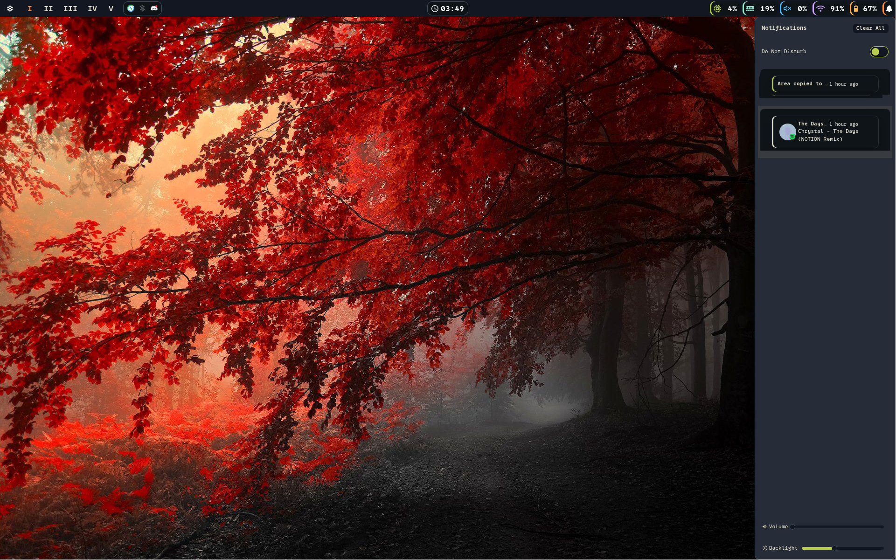
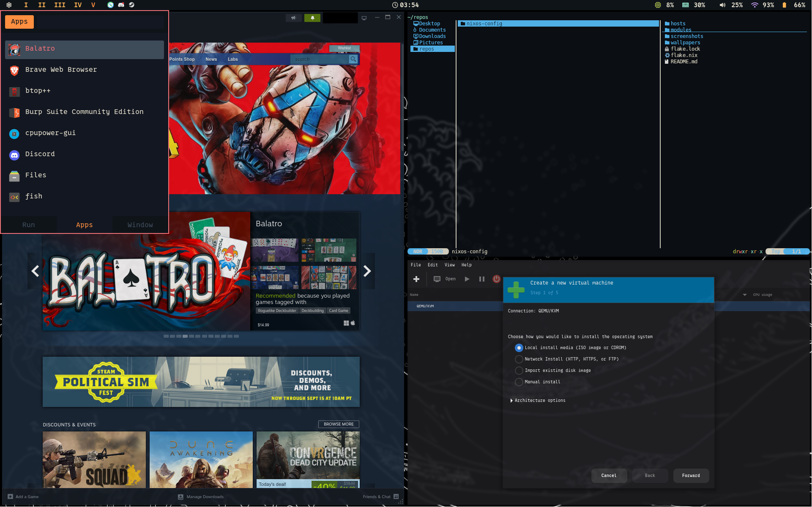
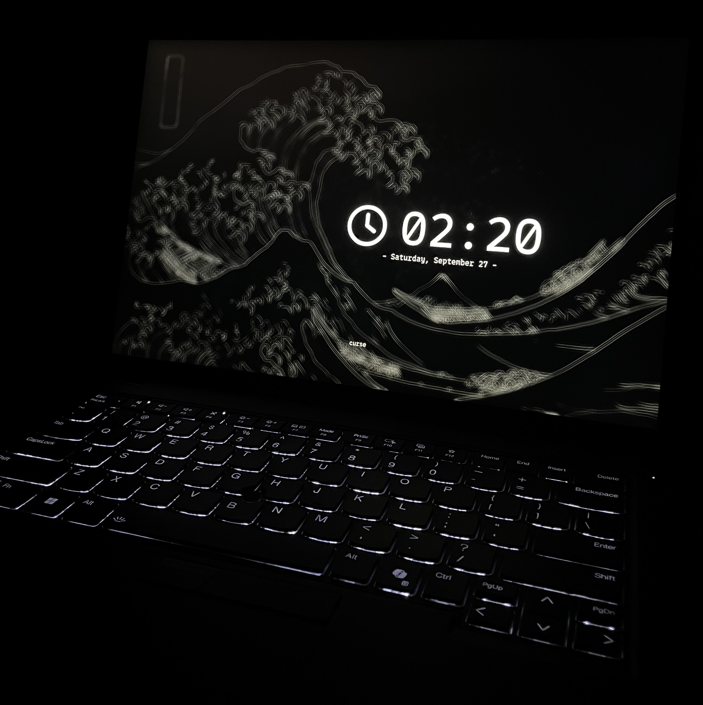
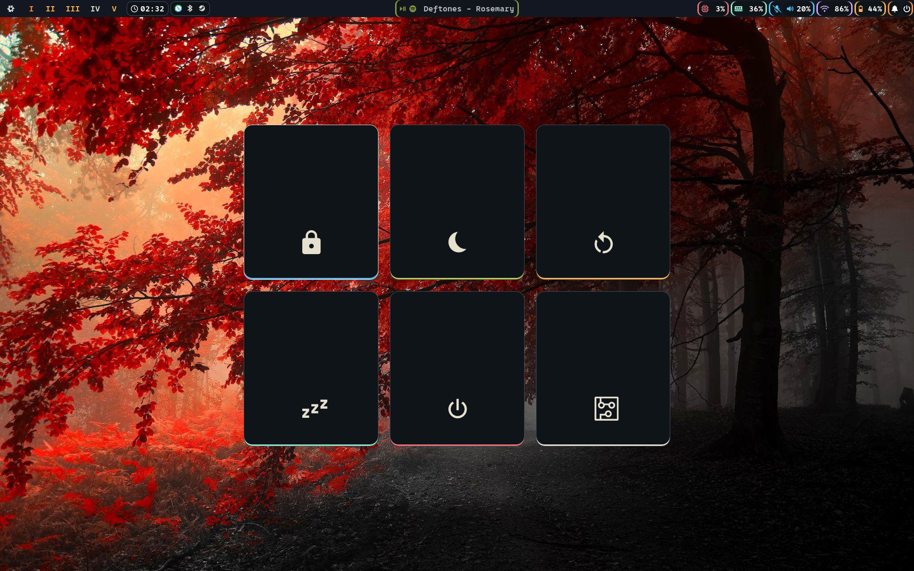

<div align="center">

<p align="center">
  <a href="https://github.com/lj-sec" target="_blank">
    
  </a>
</p>

<p align="center">
  
  <a href="https://nixos.org">
    
  </a>
</p>

<p align="center">
  <a href="https://github.com/lj-sec">
    
  </a>
</p>

# LJ's Nix Flake

</div>

This repository contains my personal NixOS configuration, managed declaratively with flakes and home-manager.  
The goal of this repository is to build a usable, user-friendly NixOS setup that stays out of the way and lets me focus on being productive.

---

## Screenshots

- **Desktop**  
  
  

- **Hyprlock**  
  

- **Wlogout**
  

---

## Directory Structure

```
nixos-config/
├── flake.nix
├── flake.lock
├── hosts/
│   ├── t14g5-nixos/
│   └── omen30l-nixos/
├── modules/
│   ├── core/
│   │   └── services/
│   └── home/
│       ├── hyprland/
│       ├── theme/
│       └── vscode/
└── wallpapers/
```
---

## Features

- **Hyprland** as the Wayland compositor, with 10 workspaces
- **Rofi** as the fast, lightweight application launcher
- **Waybar** as the status bar with functional and clickable modules
- **SwayNC** as the notification daemon and center
- **Fish shell** with declarative aliases and customizations
- **Nix-Colors** integration for consistent theming across supported apps
- **GTK theming** for cursor, fonts, and color schemes
- **Security tools** with packages for hardening, recon, and penetration testing
- **Gaming support** via Steam and GE-Proton
- **Virtualization support** including libvirt, virt-manager, and SPICE
- Plus a wide selection of common, daily-use applications for a reliable, everyday computing experience

---

## Fish Aliases

<details>
<summary>rebuild</summary>

### Usage:
```bash
rebuild [ACTION] [FLAKE] [HOST]
```

### Output:
```bash
sudo nixos-rebuild [ACTION] [FLAKE]#[HOST]
```

### Default:
```bash
sudo nixos-rebuild switch .#$(hostname)
```

</details>

---

## System Notes

This setup was built mostly on and for a Lenovo ThinkPad T14 Gen5 (AMD) 21MC, and some bugs are still being resolved.
Some quirks of note that have been run into:
 - This keyboard's micmute button and LED have been impossible to configure, as it is not throwing XF86AudioMicMute when pressed as it should. In this repo I have created a script and a service that hooks into wireplumber and pipewire to ensure the accuracy of the LED via writing directly to `/sys/class/leds/platform::micmute/brightness` and the waybar custom-mic module. For now, I have also bound SUPER + M to toggle the microphone.
 - The Steam games that have been tested on the ThinkPad (i.e. Noita, Balatro) have only launched when forced to use the GE-Proton Compatibility tool. When using GE-Proton, no issues.
 - The custom waybar-lyric module will use high CPU when Spotify has not been at least launched once in the environment. Workaround is Spotify is launched in workspace 5 on boot. This module works cleanly unless the Spotify DJ is talking, to which it crashes.

The other system currently being tested is an HP Omen 30L (i9-10850K, RTX 3070), which notably built second try after properly configuring the swapfile despite such different hardware. Updates to come.

---


## Installation

> [!CAUTION]  
> I am **not responsible** for any data loss, broken systems, or misconfigurations that may result from using this repository. This is still in an early stage.
> Use at your own risk, and review configs before applying them to your machine.

> [!WARNING]  
> This configuration is tailored to my hardware, and sits on top of btrfs.  
> You will need to adjust `hosts/<your-host>/hardware-configuration.nix` and other modules for your setup.
> You will also need to create your own swapfile or adjust the path(s) in `modules/core/sleep.nix`

### 0. Requirements

- NixOS 25.11 or newer
- Home Manager module support
- UEFI system with Btrfs (recommended)
- Internet connection for flake inputs

If you’re starting from scratch:
 - Download the official ISO: → [https://nixos.org/download](https://nixos.org/download)
 - Follow the official installation guide: → [https://nixos.org/manual/nixos/stable/#sec-installation](https://nixos.org/manual/nixos/stable/#sec-installation)
 - Partition your drive with EFI + Btrfs, or your file system of choice
 - When finished, your system’s hardware configuration will live at `/etc/nixos/hardware-configuration.nix`

Once NixOS boots successfully, continue below to integrate this flake.

### 1. Create a swap file for hibernation:

```bash
sudo mkdir -p /var/lib/swap
sudo chattr +C /var/lib/swap                # Disable COW on btrfs
sudo fallocate -l <size-of-RAM>G /var/lib/swap/swapfile
sudo chmod 600 /var/lib/swap/swapfile
sudo mkswap /var/lib/swap/swapfile
```

Then record the device UUID and offset (you’ll need these for your swap.nix):
```bash
# Find UUID of the partition containing your swapfile
df --output=source /var/lib/swap/swapfile | tail -1

# On btrfs, find the swapfile offset:
sudo btrfs inspect-internal map-swapfile -r /var/lib/swap/swapfile
```

### 2. Set up host configuration:

You have two choices:

<details>
<summary>Option A - Modifying an existing host</summary>
<br>
Clone this repository and enter it:

```bash
git clone https://github.com/lj-sec/nixos-config.git
cd nixos-config
```

Replace the contents of one of the present host's hardware-configuration.nix with your own:
```bash
sudo cp /etc/nixos/hardware-configuration.nix hosts/<your-host>
```

Open swap.nix in your editor and update:
 - resume_offset= → your offset from earlier
 - resumeDevice= → your swap partition’s UUID path
 - size= → the size of your swapfile in GiB

Ensure that in flake.nix the specialArgs `hasFingerprint` aligns with your preference on fingerprint authentication.

And you're finished with this step!

</details>

<details>
<summary>Option B - Creating your own host</summary>
<br>

```bash
git clone https://github.com/lj-sec/nixos-config.git
cd nixos-config/hosts
mkdir <your-host>
sudo cp /etc/nixos/hardware-configuration.nix <your-host>
touch <your-host>/default.nix
touch <your-host>/swap.nix
```
Modify default.nix and swap.nix, mimicking the setup that is present in the other hosts present.
Ensure that `default.nix` imports `./../../modules/core`, `./hardware-configuration.nix`, and `./swap.nix` at a minimum, as that ensures the rest of the flake is strapped in.

---

</details>

### 3. Apply the configuration

Finally, from the root of the repository:
```bash
sudo nixos-rebuild switch --flake .#<your-host>
```

---

## Shoutout

A lot of my inspiration (and some configs) came from [Frost-Phoenix’s nixos-config](https://github.com/Frost-Phoenix/nixos-config/tree/main).

---

## Background Credit

The wallpapers in the `./wallpapers/` directory were sourced from [WallpaperAccess](https://wallpaperaccess.com/).  
I do not claim ownership of these images. All rights belong to their respective creators.

If you are the copyright holder of one of these wallpapers and would like it removed or credited differently, please contact me.