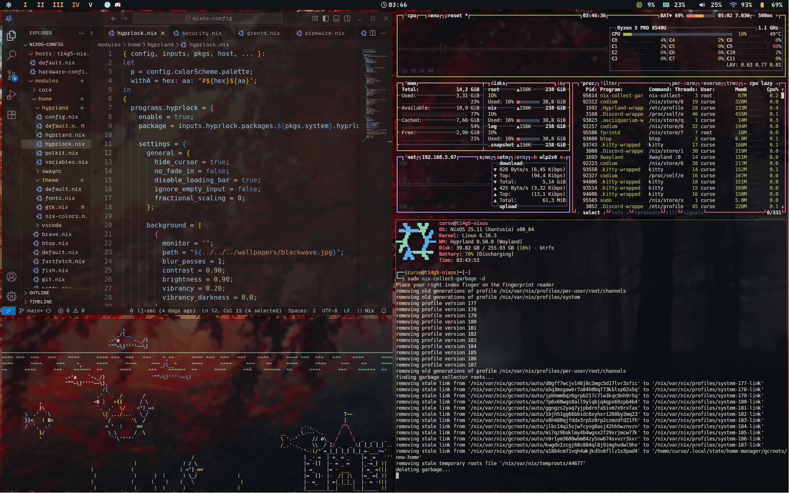
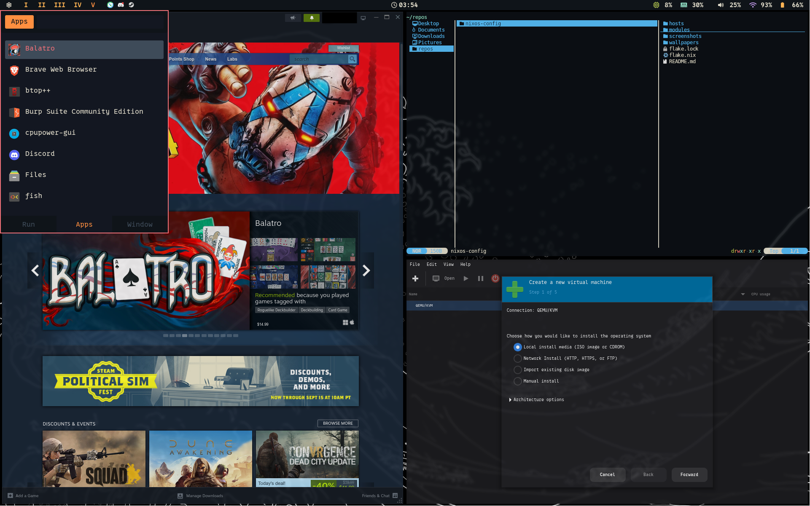
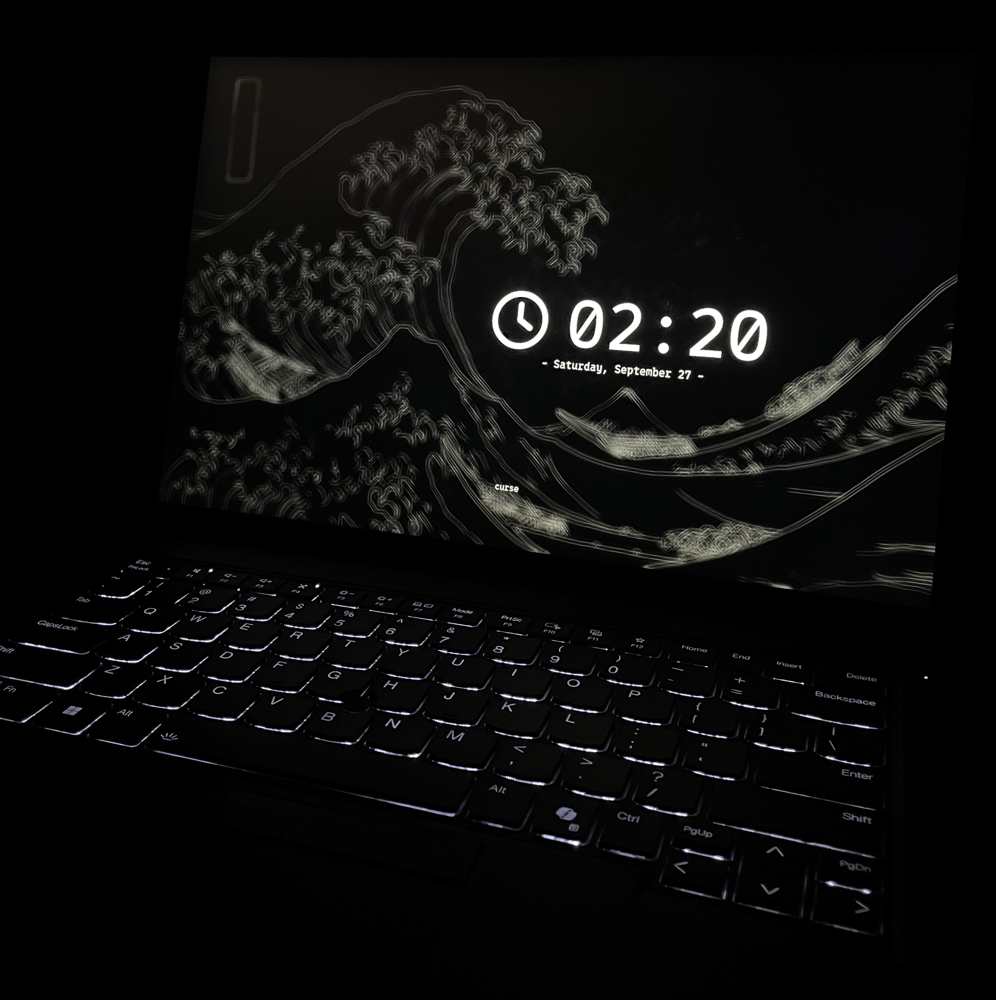
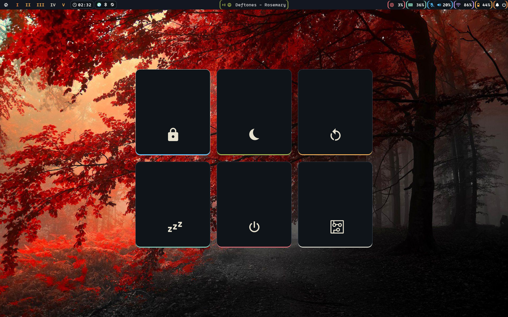

<div align="center">

<p align="center">
  <a href="https://github.com/lj-sec" target="_blank">
    
  </a>
</p>

<p align="center">
  
  <a href="https://nixos.org">
    
  </a>
</p>

<p align="center">
  <a href="https://github.com/lj-sec">
    
  </a>
</p>

# LJ's Nix Flake

</div>

This repository contains my personal NixOS configuration, managed declaratively with flakes and home-manager.  
The goal of this repository is to build a usable, user-friendly NixOS setup that stays out of the way and lets me focus on being productive.

---

## Screenshots

- **Desktop**  
  
  

- **Hyprlock**  
  

- **Wlogout**
  

---

## Directory Structure

```
nixos-config/
├── flake.nix
├── flake.lock
├── hosts/
│   ├── t14g5-nixos/
│   ├── omen30l-nixos/
│   └── etc...
├── modules/
│   ├── core/
│   │   └── services/
│   └── home/
│       ├── distrobox/
│       │   ├── kali/
│       │   └── etc...
│       ├── hyprland/
│       ├── theme/
│       └── vscode/
└── wallpapers/
```
---

## Features

- **Hyprland** as the Wayland compositor, with 10 workspaces
- **Rofi** as the application launcher
- **Waybar** as the status bar with functional and clickable modules
- **SwayNC** as the notification daemon and center
- **Fish shell** with declarative aliases and customizations
- **Nix-Colors** integration for consistent theming across supported apps
- **Gaming support** via Steam and GE-Proton
- **Virtualization support** via libvirt, virt-manager, and SPICE
- **Distrobox** for containers
  - **Kali Linux** configuration is located at `./modules/home/distrobox/kali`, where apt packages can be declaratively defined

---

## Fish Aliases

<details>
  <summary>rebuild</summary>

  ### Usage:
  ```bash
  rebuild [ACTION] [FLAKE] [HOST]
  ```

  ### Output:
  ```bash
  sudo nixos-rebuild [ACTION] [FLAKE]#[HOST]
  ```

  ### Default:
  ```bash
  sudo nixos-rebuild switch .#$(hostname)
  ```
</details>

<details>
  <summary>passcp</summary>

  ### Usage:
  ```bash
  passcp [ACCOUNT]
  ```

  ### Output:
  ```bash
  pass show [ACCOUNT] | wl-copy
  ```
</details>

<details>
<summary>promisc</summary>

  ### Usage:
  ```bash
  promisc [INTERFACE]
  ```

  ### Output:
  ```bash
  # Toggle promisc:
  sudo ip link set [INTERFACE] promisc on
  # Or, if on:
  sudo ip link set [INTERFACE] promisc off
  ```
</details>

<details>
<summary>split_dir</summary>

  ### Usage:
  ```bash
    split_dir <SRC> <OUTDIR> <MULT><SIZE>"
  ```

  ### Output:
  Splits the SRC directory into OUTDIR into directories that are of <MULT><SIZE> or smaller where <MULT> is how many of <SIZE> bytes.

  ### Examples:
  ```bash
  split_dir ./data/ ./output/       # Default splits into equal chunks
  split_dir ./data/ ./output/ 50MB  # 50MB even dirs
  split_dir ./data/ ./output/ 1.5GB # 1.5GB even dirs
  ```

</details>

<details>
<summary>gpssl</summary>

  ### Alias:
  ```bash
  sudo gpclient --fix-openssl connect
  ```
</details>

<details>
  <summary>l</summary>

  ### Alias:
  ```bash
  ls -alh
  ```
</details>

<details>
<summary>ll</summary>

  ### Alias:
  ```bash
  ls -l
  ```
</details>

<details>
<summary>gs</summary>

  ### Alias:
  ```bash
  git status
  ```
</details>

---

## System Notes

This setup was built mostly on and for a Lenovo ThinkPad T14 Gen5 (AMD) 21MC, and some bugs are still being resolved.
Some quirks of note that have been run into:
 - This keyboard's micmute button and LED have been flaky to configure, as it is not throwing XF86AudioMicMute when pressed as it should. In this repo I have created a script and a service located in `./hosts/t14g5-nixos/default.nix` to ensure the accuracy of the LED via writing directly to `/sys/class/leds/platform::micmute/brightness` and the waybar custom-mic module.
 - The Steam games that have been tested on the ThinkPad (i.e. Noita, Balatro) have only launched when forced to use the GE-Proton Compatibility tool. When using GE-Proton, no issues.

---


## Installation

> [!CAUTION]  
> The author is **not responsible** for any data loss, broken systems, or misconfigurations that may result from using this repository.
> Use at your own risk, and review configs before applying them to your machine.

> [!WARNING]  
> This configuration is tailored to my hardware, and sits on top of btrfs.  
> You will need to adjust `hosts/<your-host>/hardware-configuration.nix` and other modules for your setup.
> You will also need to choose a swapfile size and verify hibernation offsets on the installed machine.

The current reinstall workflow is documented in [`docs/reinstall.md`](./docs/reinstall.md). Use it for:

- full-disk NixOS reinstall on the laptop
- installing an existing host onto filesystems already mounted at `/mnt`
- generating a new host scaffold
- understanding the Btrfs swapfile and hibernation offset flow

Quick full-disk reinstall entrypoint from a NixOS installer shell:

```bash
git clone https://github.com/lj-sec/nixos-config.git
cd nixos-config
sudo bash scripts/full-disk-install.sh --host t14g5-nixos --username curse
```

The script prints the selected disk and requires an exact `WIPE /dev/...` confirmation before partitioning or formatting.

### 0. Requirements

- NixOS 26.05 stable or the stable release tracked by `flake.nix`
- Home Manager module support
- UEFI system with Btrfs (recommended)
- Internet connection for flake inputs

If you’re starting from scratch:
 - Download the official ISO: [https://nixos.org/download](https://nixos.org/download)
 - Follow the official installation guide: [https://nixos.org/manual/nixos/stable/#sec-installation](https://nixos.org/manual/nixos/stable/#sec-installation)
 - Partition your drive with EFI + Btrfs, or your file system of choice
 - When finished, your system’s hardware configuration will live at `/etc/nixos/hardware-configuration.nix`

Once NixOS boots successfully, continue below to integrate this flake.

### 1. Configure host and swap

For a new machine, generate a host scaffold:

```bash
bash scripts/new-host.sh --host <your-host> --profile laptop --swap-gib <size-of-RAM>
```

Generated hosts use the NixOS `swapDevices.*.size` option so NixOS creates the swapfile. On Btrfs, current NixOS uses `btrfs filesystem mkswapfile`, which satisfies the no-COW/no-holes swapfile requirements.

For hibernation, record the Btrfs resume offset after the real swapfile exists:

```bash
sudo btrfs inspect-internal map-swapfile -r /var/lib/swap/swapfile
```

The full-disk installer does this automatically and writes the result into `hosts/<host>/swap.nix`.

### 2. Install or rebuild

For a full-disk reinstall, use the guarded wipe workflow:

```bash
sudo bash scripts/full-disk-install.sh --host t14g5-nixos --username curse
```

For filesystems that are already mounted at `/mnt`, use the mounted install path from `./installer.sh` or run:

```bash
sudo env NIXOS_CONFIG_USERNAME=curse nixos-install --flake .#<your-host> --impure
```

For an already-installed system, rebuild from the root of the repository:

```bash
sudo nixos-rebuild switch --flake .#<your-host>
```

---

## Shoutout

A lot of inspiration (and some configs) came from [Frost-Phoenix’s nixos-config](https://github.com/Frost-Phoenix/nixos-config/tree/main).

---

---

## To Do


---

## Wallpapers

Wallpapers in the `./wallpapers/` directory were sourced from multiple sites across the internet, this is simply a small collection.
I do not claim ownership of any these images. All rights belong to their respective creators.

If you are the copyright holder of one of these wallpapers and would like it removed or credited differently, please contact me.

The default wallpapers directory that waypaper searches is `/home/${username}/Pictures/wallpapers` and can be changed in `./modules/home/waypaper.nix`.
