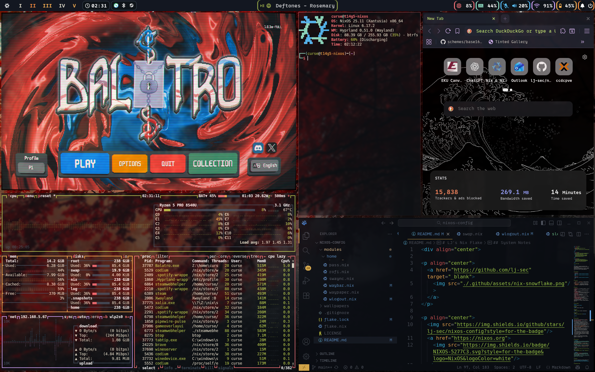

<div align="center">

<p align="center">
  <a href="https://github.com/lj-sec" target="_blank">
    
  </a>
</p>

<p align="center">
  <a href="https://github.com/lj-sec">
    
  </a>
</p>

</div>

# nixos-config

This repository contains my personal NixOS configuration, managed declaratively with flakes and home-manager.

## Screenshots

### Background 1


With VSCodium, btop, asciiquarium, and Kitty.

### Background 2


With Rofi (App Launcher), Steam, yazi, and virt-manager.

## Disclamer

This was built entirely on a Lenovo Thinkpad T14 Gen5 (AMD). No testing as to the reproducibility of this configuration on multiple hosts has been carried out thus far. Additionally, some bugs are still being stomped out, especially regarding hyprlock + fprintd, and this Thinkpad's micmute (F4) LED staying on persistently.

## Goals:

- Get a solid base config working with flakes + home-manager on top of btrfs
- Configure Hyprland as the daily driver WM
- Add custom modules for security, dev tools, and pentesting
- Keep dotfiles tidy and portable
- Slowly build this into a fully automated setup I can rebuild anywhere

## Structure

This repo is organized as follows:

 - `flake.nix` / `flake.lock` - flake entry
 - `hosts/` - per-host configs (my T14)
 - `modules/core/`- system-wide configurations
 - `modules/home/` - home-manager configurations
 - `wallpapers/` - wallpapers used in the setup

## Features

 - **Hyprland** as the wayland compositor with Waybar, SwayNC, and Kitty
 - **Nix-Colors** integration for themes across some apps
 - **GTK Theming** for cursor, font, and coloring
 - **Security Packages** for hardening/pentesting
 - **Gaming Packages** (Steam/Proton)
 - **Virtualization Support** (libvirt, virt-manager)
 - **Fish** as the interactive shell with declared aliases
 - **Plus more...**

## Usage

To attempt to apply this configuration on your own system:
```bash
git clone https://github.com/lj-sec/nixos-config.git
cd nixos-config
sudo nixos-rebuild switch --flake .#t14g5-nixos
```
> [!CAUTION]
> ⚠️ This configuration is tailored to my hardware. You will need to adjust hosts/<your-host>/hardware-configuration.nix and other modules for your setup.

## Shoutout

A lot of this configuration and my understanding of Nix as a whole has come from studying [Frost-Phoenix's nixos-config](https://github.com/Frost-Phoenix/nixos-config/tree/main) repository. Some aspects may be copied near directly.

## Background Credit

The wallpapers located in the `./wallpapers/` directory were sourced from [WallpaperAccess](https://wallpaperaccess.com/).  
I do not claim ownership of these images. All rights belong to their respective creators.

If you are the copyright holder of one of these wallpapers and would like it removed or credited differently, please contact me.