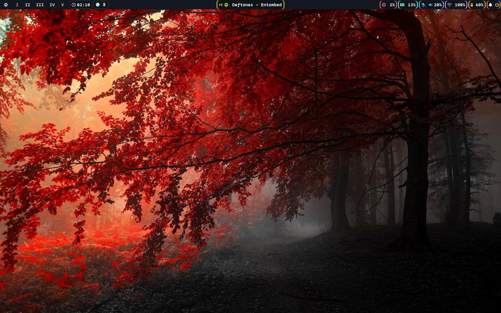

<div align="center">

<p align="center">
  <a href="https://github.com/lj-sec" target="_blank">
    
  </a>
</p>

<p align="center">
  
  <a href="https://nixos.org">
    
  </a>
</p>

<p align="center">
  <a href="https://github.com/lj-sec">
    
  </a>
</p>

# LJ's Nix Flake

</div>

This repository contains my personal NixOS configuration, managed declaratively with flakes and home-manager.  
The goal of this repository is to build a usable, user-friendly NixOS setup that stays out of the way and lets me focus on being productive.

---

## Screenshots

- **Desktop**  
  
  

- **Hyprlock**  
  

---

## Structure

- `flake.nix` / `flake.lock` – flake entrypoint
- `hosts/` – per-host configs (currently my T14 Gen5)
- `modules/core/` – system-wide configurations
- `modules/home/` – home-manager configurations
- `wallpapers/` – wallpapers used in the setup

---

## Features

- **Hyprland** as the Wayland compositor, with 10 workspaces
- **Rofi** as the fast, lightweight application launcher
- **Waybar** as the status bar with functional and clickable modules
- **SwayNC** as the notification daemon and center
- **Fish shell** with declarative aliases and customizations  
- **Nix-Colors** integration for consistent theming across supported apps  
- **GTK theming** for cursor, fonts, and color schemes  
- **Security toolkit** with packages for system hardening and penetration testing  
- **Gaming support** via Steam and Proton  
- **Virtualization support** including libvirt, virt-manager, and SPICE  
- Plus a wide selection of common, daily-use applications for a reliable, everyday computing experience  

---

## Fish Aliases

<details>
<summary>rebuild</summary>

### Usage:
```bash
rebuild [ACTION] [FLAKE] [HOST]
```

### Output:
```bash
sudo nixos-rebuild [ACTION] [FLAKE]#[HOST]
```

### Default:
```bash
sudo nixos-rebuild switch .#$(hostname)
```

</details>

---

## System Notes

This setup was built entirely on a **Lenovo ThinkPad T14 Gen5 (AMD)**.  
No testing has been carried out on other hardware, and some bugs are still being resolved, especially regarding Hyprlock + fprintd and this ThinkPad’s mic-mute (F4) LED staying on persistently.  

Testing on virtual machines and my personal desktop is in progress, with new host modules planned for different needs.

---

## Installation

> [!CAUTION]  
> This configuration is tailored to my hardware, relies heavily on fingerprint authentication, and sits on top of btrfs.  
> You will need to adjust `hosts/<your-host>/hardware-configuration.nix` and other modules for your setup.
> You will also need to create your own swapfile or adjust the path(s) in `modules/core/sleep.nix`

To attempt to apply this configuration on your own system:
```bash
git clone https://github.com/lj-sec/nixos-config.git
cd nixos-config
sudo nixos-rebuild switch --flake .#t14g5-nixos
```

> [!WARNING]  
> I am **not responsible** for any data loss, broken systems, or misconfigurations that may result from using this repository. This is still in an early stage.
> Use at your own risk, and review configs before applying them to your machine.

---

## Shoutout

A lot of my inspiration (and some configs) came from [Frost-Phoenix’s nixos-config](https://github.com/Frost-Phoenix/nixos-config/tree/main).

---

## Background Credit

The wallpapers in the `./wallpapers/` directory were sourced from [WallpaperAccess](https://wallpaperaccess.com/).  
I do not claim ownership of these images. All rights belong to their respective creators.

If you are the copyright holder of one of these wallpapers and would like it removed or credited differently, please contact me.